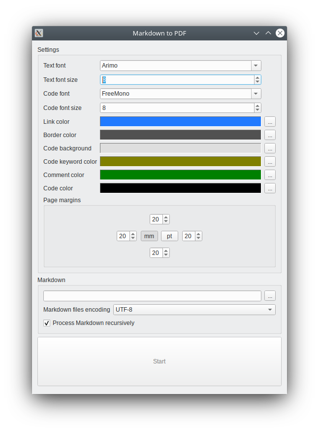

[](https://github.com/igormironchik/md-pdf/actions)[](https://codecov.io/gh/igormironchik/md-pdf)[](https://opensource.org/licenses/GPL-3.0)

# About

Converter of Markdown to PDF.

Why another Markdown to PDF converter?
Because I want to feed root Markdown file to the application and get
complete PDF with all subpages that linked in root file. I tried to find
such ready tool, but my search was unsuccessful.

# Installers

You can get `x64` installers for `Linux` and `Windows` [here](https://github.com/igormironchik/markdown).

# Testing

If you will find a bug of rendering, please, try to localize the issue in
short Markdown and reproduce with fonts in `tests/fonts` folder (`Droid Serif` for text
and `Courier New` for code). And post the issue here...

# Getting from Repository

After clone update submodules with the next command:

```
git submodule update --init --recursive
```

# Building

To build this application first of all install dependencies of `PoDoFo`

 * `openssl`
 * `freetype`
 * `libjpeg`
 * `libpng`
 * `zlib`
 * `libtiff` - optional
 * `libxml2`
 * `fontconfig`

Also `ImageMagick 6` is required.

With these dependencies installed just open `CMakeLists.txt` in `QtCreator`
(or use `CMake` from command line) and run build.

You can use `Conan` to install dependencies, only `ImageMagick` should be installed by hands, as in
`Conan` `ImageMagick` available version is 7 only, and not all platforms are supported. And
`Fontconfig` should be installed in system, as using `Fontconfig` from `Conan` leads to ugly UI.
Good luck!

And one more thing - don't use `jom`.

## Building with `QtCreator` and `Conan`

 * Be sure you enabled `Conan` plugin in `QtCreator`
 * Be sure you opt in `Preferences->CMake->General->Package manager auto setup` checkbox
 * Open `CMakeLists.txt` with `QtCreator`
 * And voila, run build and everything should go without any problem.
 
In this stack you can have problems only with `ImageMagick`, that I don't install with
`Conan`, as there is no build possible on Windows platform with `Conan`. So be sure you installed
`ImageMagick 6` and installation is available through the `PATH` environment, this should
be enough to detect `ImageMagick`. Good luck.

## On what platforms better use `Conan` to build `md-pdf`

I don't suggest to use `Conan` on MacOS, there will be conflicts with `brew` and system libraries,
as I suggest to use `Fontconfig` from system. There will be problems. Just use `brew` on MacOS to
install dependencies.

On Windows `Conan` is a fresh wind to build this project.

On Linux you can use what you want, that is why this is my favorite OS.

# Screenshot



# Known issues
 
 * I do not render HTML tags in Markdown.

 * Some LaTeX Math expressions can be wrongly rendered. I use very good
 library `JKQtPlotter` to render LaTeX Math, and not everything is
 implemented there. But most common math things are done.

 * I don't support Chinese, as they don't use spaces. I don't know theirs rules, to adapt
 algorithms.
   
 * I don't support right-to-left languages. I don't know theirs rules too[^1].
 
[^1]: If you are one from these groups of people - you are welcome to make PRs to adapt
 this application to your language.
