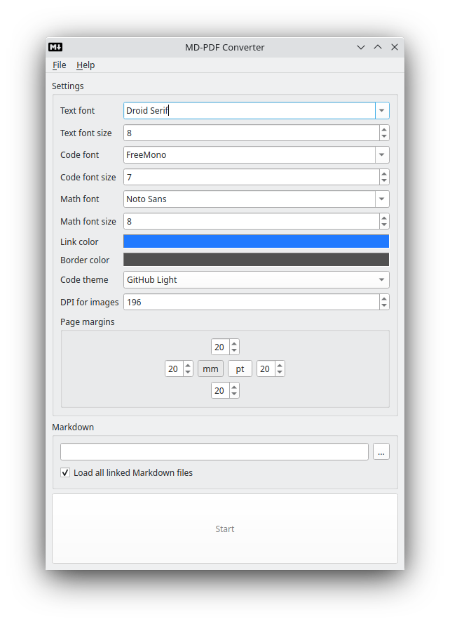

# About

Converter of Markdown to PDF.

Why another Markdown to PDF converter?
Because I want to feed root Markdown file to the application and get
complete PDF with all subpages that linked in root file. I tried to find
such ready tool, but my search was unsuccessful.

# Testing

If you will find a bug of rendering, please, try to localize the issue in
short Markdown and reproduce with fonts in `tests/fonts` folder (`Droid Serif` for text
and `Courier New` for code). And post the issue here...

# Building

To build this application first of all install dependencies of PoDoFo

* freetype
* libjpeg
* libpng
* zlib

On UNIX you also need

* fontconfig

Also ImageMagick6 is required.

With these dependencies installed just open CMakeLists.txt in QtCreator and run build.

# Example

Good example of work of this application is
[PDF version of my book.](https://github.com/igormironchik/qt-widgets-on-real-example/blob/master/pdf/The%20book%20about%20real%20examples%20of%20Qt%20Widgets%20usage.pdf)

# Screenshot

# Known issues
 
 * I do not support HTML tags in Markdown, as for PDF rendering HTML is unuseful.

 * I don't support Chinese, as they don't use spaces. I don't know theirs rules, to adapt
 algorithms.
 
   I checked on this weird [Markdown file](https://github.com/feiyangqingyun/qtkaifajingyan/blob/master/README.md), guys, they don't follow up Markdown standard even.
   
 * I don't support right-to-left languages. I don't know theirs rules too.
 
 If you are one from these groups of people - you are welcome to make PRs to adapt
 this application to your language.
